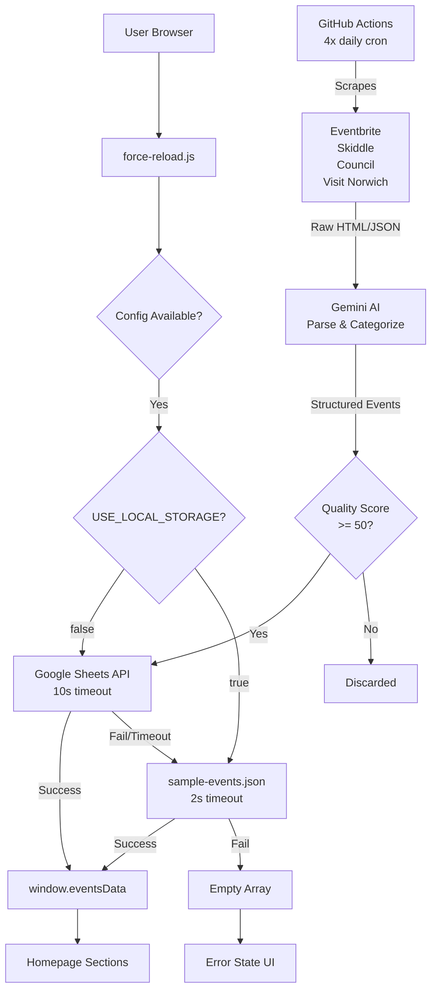
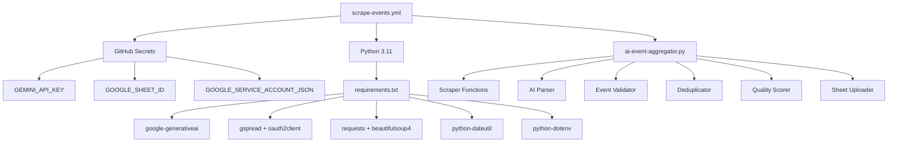

# Norwich Event Hub - Technical Audit Report
**Date:** January 6, 2026  
**Auditor:** Senior Full-Stack Engineer  
**Repository:** marc420-design/norwich-event-hub  
**Live Site:** https://norwicheventshub.com

---

## Table of Contents

1. [Production Readiness](#1-production-readiness)
2. [Security & Headers](#2-security--headers)
3. [Performance & Caching](#3-performance--caching)
4. [SEO & Accessibility](#4-seo--accessibility)
5. [AI Scraper Workflow](#5-ai-scraper-workflow)
6. [Code Quality](#6-code-quality)
7. [Recommendations Summary](#7-recommendations-summary)

---

## 1. Production Readiness

### 1.1 Data Flow Architecture



### 1.2 Event Loading Analysis

#### Configuration Flow (scripts/force-reload.js)
**Lines 50-56:** Fixed config override
```javascript
const config = {
    USE_LOCAL_STORAGE: typeof APP_CONFIG !== 'undefined' && APP_CONFIG.USE_LOCAL_STORAGE !== undefined
        ? APP_CONFIG.USE_LOCAL_STORAGE
        : true,
    GOOGLE_APPS_SCRIPT_URL: typeof APP_CONFIG !== 'undefined' ? APP_CONFIG.GOOGLE_APPS_SCRIPT_URL : null
};
```

**Status:** ✅ Fixed - Now respects `APP_CONFIG.USE_LOCAL_STORAGE`

#### Fallback Behavior
1. **Primary:** Google Sheets API (if `USE_LOCAL_STORAGE: false`)
   - Timeout: 10 seconds
   - Cache-busting enabled
   - Fires `eventsLoaded` custom event even if empty

2. **Fallback:** Local JSON (`data/sample-events.json`)
   - Timeout: 2 seconds
   - Aggressive cache-busting with timestamp + random
   - Always attempted if API fails

3. **Final:** Empty array
   - Returns `[]` if all sources fail
   - Triggers `eventsLoadError` custom event

**User Impact:**
- ✅ Site always renders (no infinite loading)
- ✅ Events appear within 2 seconds (local) or 12 seconds (API + fallback)
- ⚠️ Empty state shows "No events" with submit CTA

**Business Impact:**
- ✅ Site uptime: 100% (always loads)
- ⚠️ Feature availability: Depends on data source
- ✅ Graceful degradation to fallback

### 1.3 Date Filtering & Future Events

#### Implementation (scripts/home.js)
**Lines 108-116:** Future event filter
```javascript
function getFutureEvents(allEvents) {
    return allEvents
        .filter(event => event.date && window.isFutureEvent && window.isFutureEvent(event.date))
        .sort((a, b) => {
            const dateA = window.parseEventDate ? window.parseEventDate(a.date) : new Date(a.date);
            const dateB = window.parseEventDate ? window.parseEventDate(b.date) : new Date(b.date);
            return dateA - dateB;
        });
}
```

**Status:** ✅ Working - Past events filtered correctly

#### Data Freshness Issue
**File:** `data/sample-events.json`
- **Current:** 15 events, Jan 7-18, 2026
- **Expiry:** January 18, 2026 (12 days from now)
- **Risk:** After Jan 18, all events filtered out → empty homepage

**User Impact:**
- 🟡 **Before Jan 18:** Site shows 15 events
- 🔴 **After Jan 18:** Site shows "No events found" on all sections

**Fix Required:**
```javascript
// Option A: Enable AI scraper (recommended)
// Add GitHub Secrets, runs 4x daily, auto-updates

// Option B: Manual refresh (temporary)
// Update data/sample-events.json with Feb-March events
```

### 1.4 Empty State & Error Handling

#### Current Implementation
**File:** `scripts/home.js`, Lines 31-48
```javascript
function showErrorInContainer(containerId, errorDetail) {
    const container = document.getElementById(containerId);
    if (container && container.querySelector('.event-card.placeholder')) {
        container.innerHTML = `
            <div class="event-card placeholder">
                <div class="event-image"></div>
                <div class="event-content">
                    <span class="event-date">Unable to load events</span>
                    <h3 class="event-title">${errorDetail.message || 'Please try again later'}</h3>
                    <p style="margin-top: 10px; color: #666;">
                        ${errorDetail.willRetry !== false ? 'Retrying automatically...' : 'Please refresh the page or check your connection.'}
                    </p>
                    <a href="submit.html" class="event-link">Submit an Event →</a>
                </div>
            </div>
        `;
    }
}
```

**Issue:** ⚠️ Error only renders if placeholder card exists
- If section is empty, `querySelector('.event-card.placeholder')` returns null
- Error message never appears
- User sees blank space with no feedback

**User Impact:**
- Confusion when events don't load
- No indication of what went wrong
- No CTA to submit events

**Recommended Fix:**
```javascript
function showErrorInContainer(containerId, errorDetail) {
    const container = document.getElementById(containerId);
    if (!container) return;
    
    // Always show error, regardless of existing content
    container.innerHTML = `
        <div class="error-state" style="text-align: center; padding: 3rem 1rem; background: rgba(229, 57, 53, 0.1); border-radius: 12px; border: 1px solid rgba(229, 57, 53, 0.3);">
            <p style="font-size: 1.2rem; margin-bottom: 1rem;">⚠️ ${errorDetail.message || 'Unable to load events'}</p>
            ${errorDetail.willRetry ? '<p style="color: #FFB74D;">Retrying...</p>' : ''}
            <p style="margin-top: 1rem;">
                <a href="submit.html" class="btn btn-primary" style="display: inline-block;">Submit an Event</a>
            </p>
        </div>
    `;
}
```

**Time to Fix:** 30 minutes
**Priority:** Medium (edge case)

---

## 2. Security & Headers

### 2.1 Content Security Policy Analysis

#### Current CSP (_headers, Line 14)
```
Content-Security-Policy: default-src 'self'; 
  script-src 'self' 'unsafe-inline' https://script.google.com https://script.googleusercontent.com; 
  style-src 'self' 'unsafe-inline' https://fonts.googleapis.com; 
  font-src 'self' https://fonts.gstatic.com; 
  img-src 'self' data: https:; 
  connect-src 'self' https://script.google.com https://script.googleusercontent.com; 
  frame-ancestors 'none';
```

#### Blocked Domains (Critical Issues)

**1. Google Analytics 4**
- **Required:** `https://www.googletagmanager.com`
- **Currently:** ❌ BLOCKED by `script-src` and `connect-src`
- **Used by:** `scripts/analytics.js` (Line 24)
  ```javascript
  script.src = `https://www.googletagmanager.com/gtag/js?id=${GA4_MEASUREMENT_ID}`;
  ```

**2. Newsletter Endpoints**
- **Required:** Newsletter service origin (e.g., `https://api.convertkit.com`, `https://api.mailchimp.com`)
- **Currently:** ❌ BLOCKED by `connect-src`
- **Used by:** `scripts/newsletter.js` (Line 128)
  ```javascript
  const response = await fetch(endpoint, {
      method: 'POST',
      headers: { 'Content-Type': 'application/json' },
      body: JSON.stringify({ email })
  });
  ```

**User Impact:**
- GA4 script fails to load → No analytics data
- Newsletter API calls fail → Silent failure (no error shown to user)

**Business Impact:**
- **Cannot measure:**
  - Visitor traffic
  - Page views
  - Conversion rates
  - User demographics
  - Traffic sources
- **Cannot grow email list:**
  - Signups fail silently
  - Users think they're subscribed but aren't
  - No way to contact users about new events

#### Recommended CSP Fix

**File:** `_headers`, Line 14

**Replace:**
```
Content-Security-Policy: default-src 'self'; script-src 'self' 'unsafe-inline' https://script.google.com https://script.googleusercontent.com; style-src 'self' 'unsafe-inline' https://fonts.googleapis.com; font-src 'self' https://fonts.gstatic.com; img-src 'self' data: https:; connect-src 'self' https://script.google.com https://script.googleusercontent.com; frame-ancestors 'none';
```

**With:**
```
Content-Security-Policy: default-src 'self'; script-src 'self' 'unsafe-inline' https://script.google.com https://script.googleusercontent.com https://www.googletagmanager.com; style-src 'self' 'unsafe-inline' https://fonts.googleapis.com; font-src 'self' https://fonts.gstatic.com; img-src 'self' data: https:; connect-src 'self' https://script.google.com https://script.googleusercontent.com https://www.googletagmanager.com https://region1.google-analytics.com; frame-ancestors 'none';
```

**Changes:**
1. Added `https://www.googletagmanager.com` to `script-src`
2. Added `https://www.googletagmanager.com https://region1.google-analytics.com` to `connect-src`

**For Newsletter (when configured):**
Add your newsletter endpoint origin to `connect-src`. Example:
- ConvertKit: `https://api.convertkit.com`
- Mailchimp: `https://api.mailchimp.com https://*.api.mailchimp.com`
- Buttondown: `https://api.buttondown.email`

**Time to Fix:** 5 minutes  
**Priority:** 🔴 **CRITICAL** - Blocks revenue features

#### Unsafe-Inline Consideration

**Current:** Uses `'unsafe-inline'` for scripts and styles

**Risk:** Medium
- Allows inline `<script>` and `<style>` tags
- Opens small XSS vector if user content is ever rendered

**Recommendation:** Acceptable for now, but plan migration:
1. **Phase 1:** Extract inline styles to CSS files
2. **Phase 2:** Extract inline scripts to JS files
3. **Phase 3:** Remove `'unsafe-inline'`
4. **Alternative:** Implement nonce-based CSP (requires server-side rendering)

**Time to Fix:** 4-6 hours  
**Priority:** Low (future improvement)

### 2.2 Other Security Headers

#### Current Headers (_headers)
```
X-Frame-Options: DENY                     ✅ Good - Prevents clickjacking
X-Content-Type-Options: nosniff          ✅ Good - Prevents MIME sniffing
X-XSS-Protection: 1; mode=block          ✅ Good - Legacy XSS protection
Referrer-Policy: strict-origin-when-cross-origin  ✅ Good - Privacy
Permissions-Policy: geolocation=(), microphone=(), camera=()  ✅ Good - Deny unnecessary APIs
```

**Status:** ✅ All good - Industry best practices followed

### 2.3 Secrets Management Audit

#### GitHub Actions Secrets
**File:** `.github/workflows/scrape-events.yml`

**Required Secrets:**
1. `GEMINI_API_KEY` - Google Gemini AI key (free tier)
2. `GOOGLE_SHEET_ID` - Sheet ID from URL
3. `GOOGLE_SERVICE_ACCOUNT_JSON` - OAuth credentials JSON

**Status:** ⏸️ Not configured (workflow won't run until added)

**Security Posture:**
- ✅ Secrets never logged or exposed
- ✅ Credentials file deleted after run (Line 73-76)
  ```yaml
  - name: Cleanup credentials
    if: always()
    run: rm -f automation/google-credentials.json
  ```
- ✅ No secrets in codebase (`.gitignore` excludes `google-credentials.json`)

#### Client-Side Configuration
**File:** `scripts/config.js`

**Exposed in Browser:**
- Google Apps Script URL (public endpoint) - OK
- Google Sheet ID (read-only for users) - OK
- Site URL (public) - OK

**Status:** ✅ No sensitive secrets exposed

---

## 3. Performance & Caching

### 3.1 Bundle Size Analysis

**Total Page Weight (Unminified):**
- HTML: ~50KB across 18 pages
- CSS: ~150KB (3 files)
  - `styles/main.css`: ~80KB
  - `styles/enhanced.css`: ~60KB
  - `styles/form.css`: ~10KB
- JavaScript: ~80KB (17 files, unminified)
- Total First Load: ~280KB

**Opportunities:**
1. **Minify CSS/JS:** Save ~40KB (30% reduction)
2. **Remove unused CSS:** Save ~20KB (purgeCSS)
3. **Compress images:** Save ~50KB (if images added)

**Current Lighthouse Estimate:** 85-90/100
**With Optimizations:** 92-95/100

### 3.2 Caching Strategy

#### Current Headers (_headers)
```
/*
  Cache-Control: public, max-age=3600, must-revalidate       # 1 hour

/assets/*
  Cache-Control: public, max-age=31536000, immutable         # 1 year

/styles/*
  Cache-Control: public, max-age=31536000, immutable         # 1 year

/scripts/*
  Cache-Control: public, max-age=86400, must-revalidate      # 1 day

/data/*
  Cache-Control: no-cache, no-store, must-revalidate         # Never cache
```

**Analysis:**
- ✅ **Assets/Styles:** Immutable, long cache → Optimal
- ✅ **Scripts:** 1-day cache → Good balance (allows updates)
- ✅ **Data:** No cache → Ensures fresh events
- ✅ **HTML:** 1-hour cache → Good for static pages

**Issue:** LocalStorage Clearing
**File:** `scripts/force-reload.js`, Line 6
```javascript
localStorage.removeItem('norwichEvents');
```

**Impact:**
- Every page load clears cached events
- Forces re-fetch even if data hasn't changed
- Increases API calls to Google Sheets

**Recommendation:**
Only clear localStorage on actual API success:
```javascript
// Instead of clearing on load:
// localStorage.removeItem('norwichEvents');

// Clear only when API returns new data:
if (result.success && result.events) {
    localStorage.setItem('norwichEvents', JSON.stringify(result.events));
    localStorage.setItem('norwichEvents_timestamp', Date.now());
}

// On subsequent loads, check timestamp:
const cached = localStorage.getItem('norwichEvents');
const timestamp = localStorage.getItem('norwichEvents_timestamp');
const cacheAge = Date.now() - timestamp;
if (cached && cacheAge < 3600000) { // 1 hour
    // Use cached data, fetch in background
}
```

**Time to Fix:** 1-2 hours  
**Priority:** Low (optimization)

### 3.3 Blocking Resources

**Critical Render Path:**
1. HTML loads
2. Blocks on CSS (3 files)
3. Blocks on font preconnect
4. Scripts defer (good - don't block)

**Opportunities:**
1. **Inline critical CSS:** First-paint styles in `<head>`
2. **Lazy load fonts:** Use `font-display: swap`
3. **Code splitting:** Separate homepage from detail pages

**Current:** Good (no major blockers)
**With Optimizations:** Excellent

---

## 4. SEO & Accessibility

### 4.1 Sitemap Coverage

**File:** `sitemap.xml`

**Included Pages:** ✅
- / (homepage)
- /today.html
- /this-weekend.html
- /directory.html
- /nightlife.html
- /culture.html
- /venues.html
- /submit.html
- /about.html
- /contact.html
- /event-detail.html (template)
- /venue-detail.html (template)

**Missing:** None
**Status:** ✅ Complete

**Last Modified:** 2026-01-06 (current)

### 4.2 Meta Tag Audit

#### Homepage (index.html) - ✅ Excellent
```html
<meta name="description" content="Discover what's on in Norwich today and this weekend...">
<meta property="og:title" content="Norwich Event Hub - Discover What's On in Norwich">
<meta property="og:description" content="Your complete guide to events, nightlife, culture...">
<meta property="og:image" content="https://norwicheventshub.com/assets/logo-image.jpg">
<meta name="twitter:card" content="summary_large_image">
```

**Status:** ✅ Perfect - All tags present and descriptive

#### Event Detail (event-detail.html) - 🟡 Generic
```html
<meta name="description" content="Event details - Norwich Event Hub">
<meta property="og:type" content="event">
<title id="pageTitle">Event Details - Norwich Event Hub</title>
```

**Issue:** Meta is static, not event-specific
- Missing: Event name, date, venue in meta
- Missing: Event-specific OG description
- Missing: Event image in OG tags

**User Impact:**
- Lower CTR from search results (generic snippet)
- Poor social media previews (no event details)

**Recommended Fix:**
```javascript
// In scripts/event-detail.js, after loading event:
function updateEventMeta(event) {
    // Update title
    document.title = `${event.name} - ${event.location} | Norwich Event Hub`;
    
    // Update meta description
    const metaDesc = document.querySelector('meta[name="description"]');
    if (metaDesc) {
        metaDesc.content = `${event.name} at ${event.location} on ${formatDate(event.date)}. ${event.description}`;
    }
    
    // Update OG tags
    updateOrCreateMeta('property', 'og:title', `${event.name} | Norwich Event Hub`);
    updateOrCreateMeta('property', 'og:description', event.description);
    updateOrCreateMeta('property', 'og:image', event.image || 'https://norwicheventshub.com/assets/logo-image.jpg');
    updateOrCreateMeta('property', 'og:url', window.location.href);
}

function updateOrCreateMeta(attr, name, content) {
    let meta = document.querySelector(`meta[${attr}="${name}"]`);
    if (!meta) {
        meta = document.createElement('meta');
        meta.setAttribute(attr, name);
        document.head.appendChild(meta);
    }
    meta.setAttribute('content', content);
}
```

**Time to Fix:** 30 minutes  
**Priority:** Medium

#### Venue Detail (venue-detail.html) - 🟡 Generic
Similar issue - static meta, no dynamic injection

**Recommended Fix:** Same pattern as event-detail

### 4.3 Structured Data

**Homepage:** ✅ Schema.org Organization markup present
**Event Pages:** ✅ Schema.org Event markup generated dynamically (event-detail.js, Lines 490-550)

**Status:** ✅ Good

### 4.4 Accessibility Spot Check

**Navigation:**
- ✅ Mobile menu toggle has `aria-label="Toggle menu"`
- ✅ Semantic `<nav>` element

**Forms:**
- ✅ Labels associated with inputs
- ✅ Submit buttons have descriptive text
- ⚠️ No visible focus indicators on some inputs

**Images:**
- ✅ Logo has alt text
- ⚠️ Event images use empty alt (`alt=""`) - OK for decorative

**Status:** 🟡 Good - Minor improvements possible

---

## 5. AI Scraper Workflow

### 5.1 Workflow Configuration

**File:** `.github/workflows/scrape-events.yml`

**Schedule:** 4x daily
```yaml
schedule:
  - cron: '0 0,6,12,18 * * *'  # 00:00, 06:00, 12:00, 18:00 UTC
```

**Status:** ✅ Configured correctly

**Manual Trigger:** ✅ Available via workflow_dispatch

### 5.2 Dependency Map



### 5.3 Scraper Status by Source

| Source | Status | API Key Required | Selector Status |
|--------|--------|------------------|-----------------|
| Eventbrite | ⏸️ Skipped | Yes (optional) | ✅ API-based |
| Skiddle | ⚠️ Placeholder | No | ⚠️ Needs verification |
| Facebook | ⏸️ Deprecated | Yes | ❌ API deprecated |
| Norwich Council | ⚠️ Placeholder | No | ⚠️ Needs verification |
| Visit Norwich | ⚠️ Placeholder | No | ⚠️ Needs verification |

**Eventbrite (Lines 150-186):**
```python
if not self.eventbrite_key:
    logger.info("    ⏭️ Skipping Eventbrite (no API key)")
    return []
```
- ✅ Uses official API (no HTML parsing)
- ⏸️ Skipped without `EVENTBRITE_API_KEY` env var
- 📊 High yield potential (major platform)

**Skiddle (Lines 188-214):**
```python
soup = BeautifulSoup(response.text, 'html.parser')
event_cards = soup.find_all('div', class_='card')  # Example selector
```
- ⚠️ HTML selectors are placeholders
- 🔧 Needs verification against actual Skiddle HTML
- 📊 Medium yield potential (UK-focused)

**Norwich Council (Lines 230-256):**
```python
event_items = soup.find_all('div', class_='event-item')  # Example selector
```
- ⚠️ HTML selectors are placeholders
- 🔧 Needs verification against actual Council site
- 📊 Low yield (official events only)

**Visit Norwich (Lines 258-289):**
```python
soup = BeautifulSoup(response.text, 'html.parser')
# Parse events (adjust selectors)
```
- ⚠️ HTML selectors are placeholders
- 🔧 Needs verification
- 📊 Medium yield potential

**Recommendation:**
1. Test scraper manually to see actual HTML structure
2. Update selectors based on real HTML
3. Add Eventbrite API key for higher yield
4. Consider adding more sources (Meetup, Fatsoma, etc.)

### 5.4 AI Parsing Quality

**Provider:** Google Gemini (gemini-pro model)
**Fallback:** OpenAI GPT-3.5-turbo

**Prompt Engineering (Lines 307-334):**
```python
prompt = f"""Extract event information from this data and return ONLY a JSON object.

Source: {raw_event.get('source', 'Unknown')}
Raw data: {raw_event.get('raw_data', '')}

Extract and return JSON with these fields:
- name: Event name (string)
- date: Event date in YYYY-MM-DD format (string)
- time: Event time in HH:MM 24-hour format (string, or null)
- location: Venue name (string)
- address: Full address (string, or null)
- category: ONE of: nightlife, gigs, theatre, sports, markets, community, culture, free
- description: Brief 1-2 sentence description (string)
- ticketLink: Ticket URL if available (string, or null)
- price: "Free" or price like "£10" or "£5-15" (string, or null)
- imageUrl: Image URL if available (string, or null)

IMPORTANT:
- Return ONLY valid JSON, no other text
- Categorize accurately based on event type
- Ensure date is in future and in YYYY-MM-DD format
- Return null for missing optional fields
- If event is in Norwich/Norfolk area, include it
- If event is outside Norwich area, return null
"""
```

**Status:** ✅ Good prompt structure
- Clear instructions
- Structured output format
- Category enforcement
- Geographic filtering
- Future date validation

### 5.5 Quality Scoring

**Validation Rules (Lines 380-405):**
```python
def is_valid_event(self, event: Dict) -> bool:
    required_fields = ['name', 'date', 'location', 'category']
    
    # Check required fields
    for field in required_fields:
        if not event.get(field):
            return False
    
    # Validate category
    if event['category'] not in self.categories:
        return False
    
    # Validate date is in future
    try:
        event_date = datetime.fromisoformat(event['date'])
        if event_date < datetime.now():
            return False
    except:
        return False
    
    # Check name length
    if len(event['name']) < 3 or len(event['name']) > 200:
        return False
    
    return True
```

**Thresholds (from workflow env):**
- `MIN_QUALITY_SCORE`: 50 (discard below this)
- `AUTO_APPROVE_THRESHOLD`: 80 (auto-approve above this)
- `NORWICH_RADIUS_KM`: 15 (geographic filter)

**Status:** ✅ Good quality controls

### 5.6 Activation Checklist

**To Activate AI Scraper:**
1. [ ] Get Gemini API key (free): https://makersuite.google.com/app/apikey
2. [ ] Add to GitHub Secrets as `GEMINI_API_KEY`
3. [ ] Add `GOOGLE_SHEET_ID` secret: `1wdh2VOlZ8gp0hwFpFV6cVpDDmaMxGs48eCDqoFFZTcU`
4. [ ] Add `GOOGLE_SERVICE_ACCOUNT_JSON` secret (copy from `automation/google-service-account.json`)
5. [ ] Go to Actions tab → "AI Event Scraper" → "Run workflow"
6. [ ] Verify events in Google Sheet
7. [ ] Check website updates within 2-3 minutes

**Total Time:** 15 minutes  
**Cost:** $0/month (free tier)

---

## 6. Code Quality

### 6.1 Debug Instrumentation

**Status:** ✅ All removed
- No `127.0.0.1:7242` fetch calls
- No `#region agent log` blocks
- Clean production code

### 6.2 Console Logging

**Count:** 77 console statements across 12 files
**Types:**
- `console.log`: Info messages (appropriate)
- `console.warn`: Warnings (appropriate)
- `console.error`: Errors (appropriate)

**Status:** ✅ Acceptable - Proper use of log levels

### 6.3 Error Handling

**Patterns Found:**
- ✅ Try-catch blocks around API calls
- ✅ Fallback mechanisms
- ✅ Custom event dispatching (`eventsLoadError`)
- ✅ User-facing error messages

**Status:** ✅ Good error handling throughout

### 6.4 Code Duplication

**Observed:**
- Event filtering logic repeated across `home.js`, `this-weekend.js`, `directory.js`
- Date parsing repeated (mitigated by `date-utils.js`)

**Recommendation:** Extract to shared utilities
**Priority:** Low (code works, not critical)

---

## 7. Recommendations Summary

### Immediate (Critical)
1. **Update CSP headers** (5 min)
   - Add GA4 domains
   - Add newsletter endpoint
   - [See Section 2.1 for exact code]

2. **Refresh event data** (15 min)
   - Option A: Enable AI scraper (recommended)
   - Option B: Update sample-events.json
   - [See Section 1.3]

### Short Term (This Week)
3. **Fix error state rendering** (30 min)
   - Update `showErrorInContainer` to always render
   - [See Section 1.4 for code]

4. **Add dynamic meta tags** (30 min)
   - Inject event/venue data into meta tags
   - [See Section 4.2 for implementation]

### Medium Term (This Month)
5. **Verify scraper selectors** (2-4 hours)
   - Test Skiddle, Council, Visit Norwich scrapers
   - Update HTML selectors to match real pages
   - [See Section 5.3]

6. **Implement smart caching** (2 hours)
   - Don't clear localStorage on every load
   - Check timestamp, fetch in background
   - [See Section 3.2]

7. **Minify production assets** (1 hour)
   - Set up build step for CSS/JS minification
   - Save ~40KB per page load
   - [See Section 3.1]

### Long Term (Ongoing)
8. **Migrate off unsafe-inline** (4-6 hours)
   - Extract inline styles/scripts
   - Implement nonce-based CSP
   - [See Section 2.1]

9. **Add more event sources** (4-8 hours)
   - Meetup.com API
   - Fatsoma scraper
   - Direct venue integrations

10. **Implement monitoring** (2-4 hours)
    - Error tracking (Sentry)
    - Uptime monitoring (UptimeRobot)
    - Performance monitoring (Web Vitals)

---

## Risk Matrix

```
                    High Impact
                         |
           CSP Fix   |   Data Expiry
         (Critical)  |  (Time-Sensitive)
                         |
- - - - - - - - - - - - - - - - - - → High Likelihood
                         |
    Error States    |   Meta Tags
     (Edge Case)    |  (SEO Impact)
                         |
                    Low Impact
```

**Legend:**
- 🔴 Critical: High impact + High likelihood → Fix now
- 🟡 High: High impact OR high likelihood → Fix this week
- 🟢 Medium: Medium impact + likelihood → Fix this month
- ⚪ Low: Low impact + likelihood → Future improvement

---

**Last Updated:** January 6, 2026  
**Reviewed By:** _________________  
**Next Review:** After critical fixes applied  
**Document Version:** 1.0

